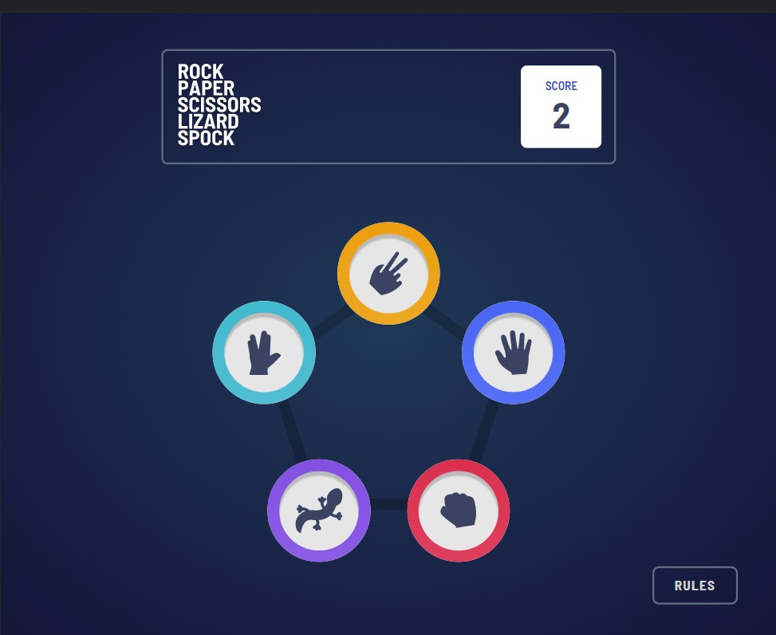
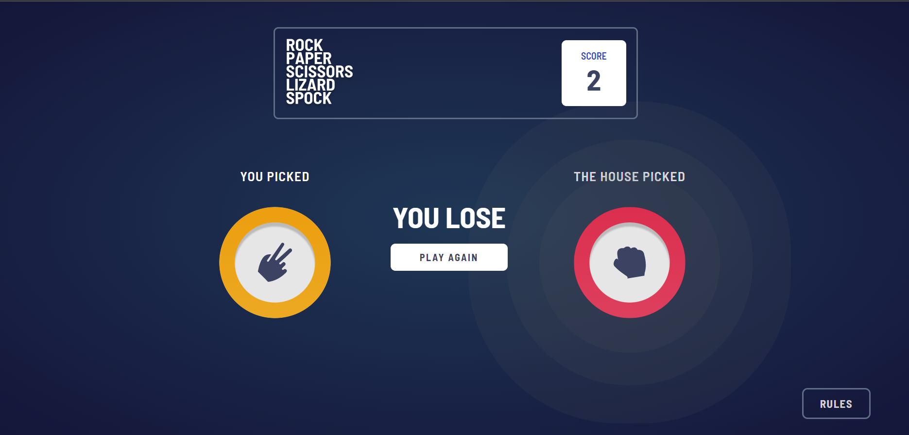

# Frontend Mentor - Rock, Paper, Scissors solution

This is a solution to the [Rock, Paper, Scissors challenge on Frontend Mentor](https://www.frontendmentor.io/challenges/rock-paper-scissors-game-pTgwgvgH). Frontend Mentor challenges help you improve your coding skills by building realistic projects. 

## Table of contents

- [Overview](#overview)
  - [Features](#features)
  - [Screenshot](#screenshot)
  - [Links](#links)
- [My process](#my-process)
  - [Built with](#built-with)
  - [What I learned](#what-i-learned)
- [Author](#author)

## Overview

### Features

Users can:

- View the optimal layout for the game depending on their device's screen size
- Play Rock, Paper, Scissors, Lizard, Spock against the computer
- Retain their current score after refreshing the browser

### Screenshot

Homepage:



Result:




### Links

- Solution URL: [Add solution URL here](https://your-solution-url.com)
- Live Site URL: [Add live site URL here](https://your-live-site-url.com)

## My process

### Built with

- Semantic HTML5 markup
- CSS custom properties
- Flexbox
- Mobile-first workflow
- [React](https://reactjs.org/) - JS library
- [Styled Components](https://styled-components.com/) - For styles
- [Framer Motion](https://framer.com/) - For animations and transitions

**Note: These are just examples. Delete this note and replace the list above with your own choices**

### What I learned

- Multiple CSS borders (using the box-shadow property).

```box shadow animation using framer-motion
boxShadow: [
    '0',
    '0 0 0 calc(20px + 2vw) hsla(0, 0%, 35%, .125)',
    '0 0 0 calc(20px + 2vw) hsla(0, 0%, 35%, .125), 0 0 0 calc(45px + 3.5vw) hsla(0, 0%, 35%, .125)',
    '0 0 0 calc(20px + 2vw) hsla(0, 0%, 35%, .125), 0 0 0 calc(45px + 3.5vw) hsla(0, 0%, 35%, .125), 0 0 0 calc(70px + 5.5vw) hsla(0, 0%, 35%, .125)'
]
```

- Performing transitions and animations using Framer Motion.

- Using `ThemeContext` from Styled Components.

```
const { colors: { rockGradient, paperGradient, scissorsGradient, lizardGradient, cyan } } = useContext(ThemeContext);
```

## Author

- Website - [Ayobami Tunwase](https://github.com/ayobami11)
- Frontend Mentor - [@yourusername](https://www.frontendmentor.io/profile/yourusername)
- Twitter - [@TunwaseAyobami](https://www.twitter.com/TunwaseAyobami)